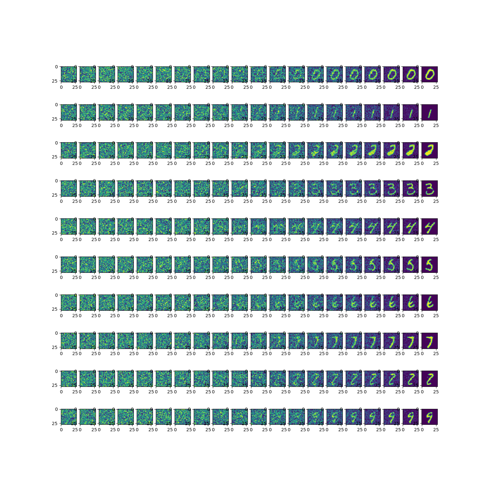

# mnist-dits

Diffusion Transformers (DiTs) trained on MNIST dataset

用transformer模型替代unet，用于实现diffusion扩散模型。

训练数据集使用了MNIST手写数字，模型传入要生成的数字，生成对应的图片。

## 模型结构

DiT模型本质上是diffusion扩散模型，只是将图像部分的unet卷积网络换成了vits网络，而vits网络则基于transformer处理图像。

在diffusion复现模型中，我也已经尝试过使用cross-attention结构引导图像生成的数字，而在DiT模型中我采用adaLN-Zero方式引导图像生成，这是DiT模型与此前3个模型之间的关系。

重要的超参数如下，参数规模必须到达一定量级才能收敛：

* embedding采用64位
* DiT Block采用3头注意力，堆叠3层


## 训练

```
python train.py

epoch:0 iter:0,loss:0.908275842666626
epoch:5 iter:1000,loss:0.11482685804367065
epoch:10 iter:2000,loss:0.0913834497332573
epoch:15 iter:3000,loss:0.08441796898841858
epoch:20 iter:4000,loss:0.07487974315881729
epoch:25 iter:5000,loss:0.07493330538272858
epoch:30 iter:6000,loss:0.0735548809170723
epoch:35 iter:7000,loss:0.06502658873796463
epoch:40 iter:8000,loss:0.06440811604261398
epoch:45 iter:9000,loss:0.06878958642482758
epoch:50 iter:10000,loss:0.06336584687232971
...
```

## 生成

扩散生成0~9对应的图片

```
python inference.py
```



## 参考论文

[Scalable Diffusion Models with Transformers](https://www.wpeebles.com/DiT)
